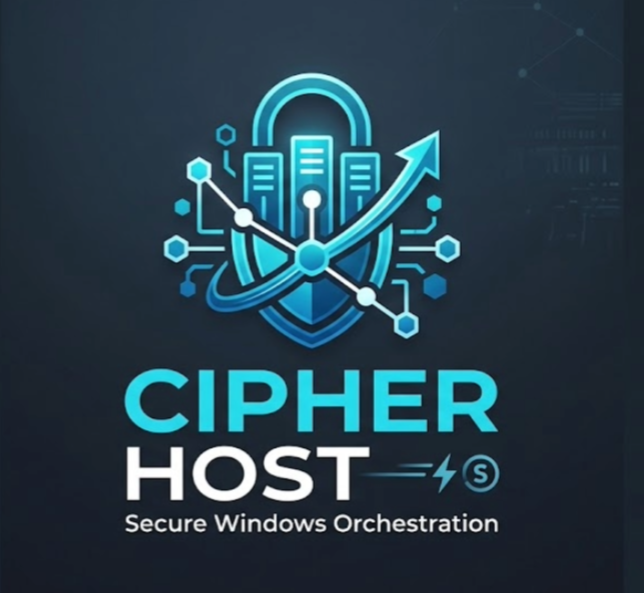

# CipherHost

<div align="center">
  
</div>

A deployment management tool for Windows Server. It handles git cloning, dependency installation, process management (PM2), reverse proxying (Caddy), and port allocation through a single web interface.

## What it does

CipherHost replaces the manual process of deploying applications on Windows Server -- RDP in, copy files, configure IIS bindings, set up services -- with a web dashboard that automates each step.

You provide a git URL or local folder path, a start command, and a domain. CipherHost clones the repo, installs dependencies, starts the process via PM2, allocates a port, and configures Caddy to route the domain to that port.

## Architecture

```
Frontend (React)  --->  Backend (Express/Node.js)  --->  Caddy (Reverse Proxy)
     :5173               :3000                            :80/:443
                            |
                     +------+------+
                     |      |      |
                   PM2   SQLite  simple-git
```

**Frontend** -- React dashboard for deploying, monitoring, and managing applications. Communicates with the backend over REST and WebSocket.

**Backend** -- Express server that orchestrates deployments. Manages the SQLite database, talks to PM2 for process lifecycle, and configures Caddy via its admin JSON API.

**Caddy** -- Reverse proxy. Receives incoming requests and routes them to the correct application port. Handles SSL certificate provisioning automatically.

## Features

- Deploy from git repositories or local folders
- Automatic project type detection (Node.js, Python, .NET)
- Port allocation from a configurable range (default 5000-6000)
- PM2 process management with health checks (30s interval)
- Caddy reverse proxy configuration via JSON API
- Domain management with automatic SSL via Let's Encrypt
- Deployment history with rollback support via snapshots
- Git webhook integration (GitHub, GitLab, Bitbucket)
- Environment variable management per application
- JWT authentication with role-based access (admin/viewer)
- API key fallback authentication
- Audit logging of all deployment actions
- WebSocket log streaming
- Responsive web UI (works on mobile)

## Tech Stack

| Component | Technology | Version |
|-----------|-----------|---------|
| Backend | Node.js + TypeScript + Express | Express 4.21, TS 5.7 |
| Frontend | React + TypeScript + Vite | React 18.3, Vite 6.0 |
| Database | SQLite | better-sqlite3 11.8 |
| Process Manager | PM2 | 5.4 |
| Reverse Proxy | Caddy | 2.11+ |
| State Management | Zustand | 5.0 |
| Data Fetching | @tanstack/react-query | 5.62 |
| CSS | Tailwind CSS | 3.4 |
| Git | simple-git | 3.27 |
| Auth | jsonwebtoken + bcrypt | - |

## Prerequisites

- Node.js v18+
- Git v2.30+
- PM2 (installed globally: `npm install -g pm2`)
- Caddy v2.7+ (binary in `caddy/caddy.exe` or on PATH)
- Windows Server 2019+ or Windows 10/11

Optional, depending on what you deploy:
- Python 3.9+ (for Python apps)
- .NET SDK 6.0+ (for .NET apps)

## Installation

```powershell
git clone <repo-url> C:\CipherHost
cd C:\CipherHost

# Backend
cd backend
npm install
copy .env.example .env
# Edit .env -- at minimum change JWT_SECRET and API_KEY

# Frontend
cd ..\frontend
npm install
copy .env.example .env
# Set VITE_API_KEY to match the backend API_KEY
```

### Configuration

Backend configuration is in `backend/.env`. Key settings:

```env
PORT=3000
JWT_SECRET=change-this-in-production
API_KEY=change-this-in-production
APPS_BASE_DIR=C:/CipherHost/apps
PORT_RANGE_MIN=5000
PORT_RANGE_MAX=6000
CADDY_API_URL=http://localhost:2019
```

See `backend/.env.example` for the full list of options.

### Start Caddy

CipherHost manages Caddy through its admin API (port 2019). Start Caddy before the backend:

```powershell
.\caddy\caddy.exe run --config "" --adapter ""
```

If port 80 is in use (e.g. by IIS), set `CADDY_HTTP_PORT` in `.env` to an alternative like `9090`.

### Start the services

```powershell
# Backend (development)
cd backend
npm run dev

# Frontend (development)
cd frontend
npm run dev
```

The frontend is available at `http://localhost:5173`. The backend runs on `http://localhost:3000`.

The database is created automatically on first start at `backend/data/cipherhost.db`. A default admin user is seeded: username `admin`, password `admin123`. Change this after first login.

### Production

```powershell
# Backend
cd backend
npm run build
npm start

# Frontend
cd frontend
npm run build
# Serve the dist/ folder via Caddy or another web server
```

## Usage

1. Log in at `http://localhost:5173` with `admin` / `admin123`
2. Go to Applications and click New Deployment
3. Choose Git Repository or Local Folder
4. Fill in the name, repo URL (or local path), domain, and start command
5. Click Deploy

CipherHost will clone the repo, detect the project type, install dependencies, start the process via PM2, allocate a port, and configure Caddy to route the domain.

### Managing applications

From the application detail page you can:

- View real-time logs (stdout/stderr from PM2)
- Restart, stop, or redeploy
- Roll back to a previous deployment version
- Manage environment variables
- Add custom domains (Caddy auto-configures reverse proxy + SSL)
- Set up git webhooks for automatic redeployment on push

### Supported project types

| Type | Detection | Build |
|------|-----------|-------|
| Node.js | `package.json` | `npm ci` (or `npm install`), optional build command |
| Python | `requirements.txt` | Creates venv, `pip install -r requirements.txt` |
| .NET | `.csproj` | `dotnet restore`, `dotnet build` |

## Project Structure

```
cipherhost/
  backend/
    src/
      config/         -- Database init, app config
      controllers/    -- REST endpoint handlers
      middleware/     -- JWT/API key auth, RBAC
      models/         -- TypeScript types
      routes/         -- Express route definitions
      services/       -- Core logic:
        deployment-service.ts   -- Deploy/redeploy/rollback orchestration
        port-manager.ts         -- Port allocation
        pm2-integration.ts      -- PM2 wrapper
        caddy-manager.ts        -- Caddy JSON API client
        health-monitor.ts       -- HTTP health checks
        git-service.ts          -- Git clone/pull
        environment-builder.ts  -- npm/pip/dotnet build
        audit-logger.ts         -- Action audit trail
        hosts-manager.ts        -- Windows hosts file management
      utils/          -- Logger (winston)
      index.ts        -- Entry point
    data/             -- SQLite database (created at runtime)
  frontend/
    src/
      components/     -- Layout, ApplicationCard, StatsCard, TechLogo, etc.
      pages/          -- Dashboard, Applications, AppDetail, Users, Login
      services/       -- API client (axios)
      store/          -- Zustand stores (auth, logs)
      types/          -- TypeScript interfaces
  docs/               -- Additional documentation
  test-apps/          -- Sample apps for testing deployments
  caddy/              -- Caddy binary
```

## Database

SQLite with WAL mode and foreign keys. 8 tables:

- `deployments` -- application registry (status, type, ports, paths)
- `port_registry` -- port allocation tracking
- `environment_variables` -- per-project env vars
- `users` -- auth users (admin/viewer roles)
- `deployment_history` -- versioned deploy records with snapshot paths
- `webhook_configs` -- git webhook settings per project
- `domains` -- domain-to-project mappings with SSL config
- `audit_logs` -- action audit trail

## Troubleshooting

**Caddy won't start / port 80 in use** -- If IIS or another service holds port 80, set `CADDY_HTTP_PORT=9090` in `.env` or stop the conflicting service.

**PM2 process won't start** -- Check `pm2 logs <app-name>` for errors. Verify the start command works when run manually in the app directory.

**Git clone fails** -- Verify `git --version` works. Check the repo URL is accessible. For private repos, configure git credentials.

**Port allocation error** -- The default range is 5000-6000. If full, stop unused deployments or increase `PORT_RANGE_MAX`.

## License

MIT
